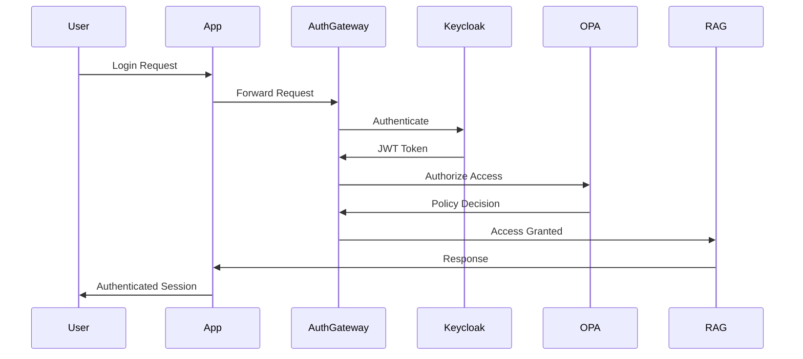

# Zero Trust Auth Service Architecture for Sensitive RAG Application

## Executive Summary

This document outlines a comprehensive authentication service architecture for a RAG (Retrieval-Augmented Generation) application deployed in a datacenter with sensitive data. The solution follows zero trust principles and ensures compliance with GDPR, CCPA, and DPDP regulations while maintaining data sovereignty.

## 1. Architecture Overview

### Core Principles
- **Zero Trust**: Zero trust assumes there is no implicit trust granted to assets or user accounts based solely on their physical or network location
- **Data Sovereignty**: All data processing remains within the datacenter
- **Privacy by Design**: GDPR, CCPA, and DPDP compliance built into the architecture
- **Continuous Verification**: Every access request is authenticated and authorized

### High-Level Components

```
┌─────────────────────────────────────────────────────────────────┐
│                     ZERO TRUST BOUNDARY                         │
├─────────────────────────────────────────────────────────────────┤
│  ┌─────────────────┐  ┌─────────────────┐  ┌─────────────────┐  │
│  │   Policy Engine │  │ Policy Decision │  │ Policy Enforce  │  │
│  │      (PEP)      │  │   Point (PDP)   │  │   Point (PEP)   │  │
│  └─────────────────┘  └─────────────────┘  └─────────────────┘  │
├─────────────────────────────────────────────────────────────────┤
│  ┌─────────────────┐  ┌─────────────────┐  ┌─────────────────┐  │
│  │   Identity      │  │   Device Trust  │  │   Session       │  │
│  │   Management    │  │   Verification  │  │   Management    │  │
│  └─────────────────┘  └─────────────────┘  └─────────────────┘  │
├─────────────────────────────────────────────────────────────────┤
│  ┌─────────────────┐  ┌─────────────────┐  ┌─────────────────┐  │
│  │   Audit &       │  │   Encryption    │  │   Privacy       │  │
│  │   Logging       │  │   Engine        │  │   Controls      │  │
│  └─────────────────┘  └─────────────────┘  └─────────────────┘  │
└─────────────────────────────────────────────────────────────────┘
```

## 2. Core Components & Technologies

### 2.1 Identity and Access Management (IAM)

**Primary Choice: OpenID Connect (OIDC) + OAuth 2.0**
- **Implementation**: [Keycloak](https://www.keycloak.org/) (Open Source)
- **Documentation**: [Keycloak Admin Guide](https://www.keycloak.org/guides#getting-started)
- **Features**: 
  - Self-hosted identity provider
  - RBAC (Role-Based Access Control)
  - ABAC (Attribute-Based Access Control)
  - Multi-factor authentication
  - Privacy-compliant user management

**Alternative Options**:
- **Dex**: Lightweight OIDC provider
- **Authelia**: Authentication and authorization server
- **FreeIPA**: Identity management system

### 2.2 Policy Engine

**Primary Choice: Open Policy Agent (OPA)**
- **Documentation**: [OPA Documentation](https://www.openpolicyagent.org/docs/)
- **Integration**: [OPA Gatekeeper](https://open-policy-agent.github.io/gatekeeper/)
- **Features**:
  - Fine-grained authorization policies
  - Real-time policy evaluation
  - Compliance policy enforcement

**Alternative Options**:
- **Casbin**: Authorization library
- **Cedar**: Amazon's authorization policy language
- **SpiceDB**: Authorization system inspired by Google Zanzibar

### 2.3 Device Trust and Verification

**Primary Choice: Certificate-Based Authentication**
- **Implementation**: Internal PKI with HashiCorp Vault
- **Documentation**: [Vault PKI Secrets Engine](https://developer.hashicorp.com/vault/docs/secrets/pki)
- **Features**:
  - Device certificates
  - Mutual TLS (mTLS)
  - Hardware security module (HSM) integration

**Alternative Options**:
- **SPIFFE/SPIRE**: Secure identity framework
- **Istio**: Service mesh with built-in security
- **Smallstep**: Certificate authority and identity platform

### 2.4 Session Management

**Primary Choice: Redis with Encryption**
- **Implementation**: Redis Cluster with TLS
- **Documentation**: [Redis Security](https://redis.io/docs/security/)
- **Features**:
  - Distributed session storage
  - Session encryption at rest
  - Configurable TTL for privacy compliance

**Alternative Options**:
- **Hazelcast**: In-memory data grid
- **Apache Ignite**: Distributed database
- **Coherence**: Distributed cache

### 2.5 Audit and Logging

**Primary Choice: ELK Stack (Elasticsearch, Logstash, Kibana)**
- **Implementation**: Self-hosted ELK with encryption
- **Documentation**: [Elastic Security](https://www.elastic.co/security)
- **Features**:
  - Centralized log management
  - Real-time monitoring
  - Compliance reporting

**Alternative Options**:
- **Fluentd + OpenSearch**: Log collection and search
- **Splunk**: Enterprise logging platform
- **Prometheus + Grafana**: Metrics and monitoring

## 3. Zero Trust Implementation

### 3.1 NIST Zero Trust Architecture Compliance

Based on NIST's approach to zero trust architecture, which continuously evaluates and verifies conditions and requests through policy engines and dynamic authentication mechanisms, our implementation includes:

**Policy Engine Components**:
- User identity verification
- Device health assessment
- Behavior analytics
- Contextual access controls

**Policy Administrator**:
- Real-time policy enforcement
- Dynamic access adjustments
- Compliance monitoring

### 3.2 Continuous Verification

```python
# Example Policy Engine Logic
def evaluate_access_request(user, device, resource, context):
    # Identity verification
    if not verify_user_identity(user):
        return DENY
    
    # Device trust assessment
    if not assess_device_trust(device):
        return DENY
    
    # Contextual analysis
    risk_score = calculate_risk_score(user, device, context)
    if risk_score > THRESHOLD:
        return REQUIRE_ADDITIONAL_AUTH
    
    # Resource-specific authorization
    if not authorize_resource_access(user, resource):
        return DENY
    
    return ALLOW
```

## 4. Data Privacy Compliance

### 4.1 GDPR Compliance

**Key Requirements**:
- **Consent Management**: Explicit consent for data processing
- **Data Minimization**: Collect only necessary data
- **Right to Erasure**: User data deletion capabilities
- **Data Portability**: Export user data in structured format

**Implementation**:
```yaml
# Privacy Configuration
privacy_controls:
  consent_management: true
  data_minimization: true
  pseudonymization: true
  encryption_at_rest: true
  right_to_erasure: true
  data_portability: true
```

### 4.2 CCPA Compliance

**Key Requirements**:
- **Transparency**: Clear privacy notices
- **Opt-out Rights**: User control over data sales
- **Data Access Rights**: User access to personal data
- **Non-discrimination**: Equal service regardless of privacy choices

### 4.3 DPDP Compliance

DPDP rules require implementing measures like encryption, obfuscation, masking or the use of virtual tokens mapped to specific personal data

**Implementation**:
- **Data Tokenization**: Replace sensitive data with tokens
- **Data Masking**: Anonymize data for non-production use
- **Encryption**: AES-256 encryption for data at rest and in transit

## 5. Technical Implementation

### 5.1 Authentication Flow



### 5.2 Microservices Architecture

**Authentication Service**:
```dockerfile
# Dockerfile for Auth Service
FROM python:3.11-slim

WORKDIR /app
COPY requirements.txt .
RUN pip install -r requirements.txt

COPY . .
EXPOSE 8000

CMD ["uvicorn", "main:app", "--host", "0.0.0.0", "--port", "8000"]
```

**Core Services**:
- **Identity Service**: User management and authentication
- **Authorization Service**: Policy evaluation and enforcement
- **Session Service**: Session management and tracking
- **Audit Service**: Logging and compliance monitoring

### 5.3 Security Configuration

**Network Security**:
```yaml
# Network Policy
apiVersion: networking.k8s.io/v1
kind: NetworkPolicy
metadata:
  name: auth-service-policy
spec:
  podSelector:
    matchLabels:
      app: auth-service
  policyTypes:
  - Ingress
  - Egress
  ingress:
  - from:
    - podSelector:
        matchLabels:
          role: api-gateway
    ports:
    - protocol: TCP
      port: 8000
```

**Encryption Configuration**:
```yaml
# TLS Configuration
tls:
  min_version: "1.3"
  cipher_suites:
    - "TLS_AES_256_GCM_SHA384"
    - "TLS_AES_128_GCM_SHA256"
  certificates:
    - cert_file: "/etc/certs/server.crt"
      key_file: "/etc/certs/server.key"
```

## 6. Deployment and Operations

### 6.1 Container Orchestration

**Kubernetes Deployment**:
```yaml
apiVersion: apps/v1
kind: Deployment
metadata:
  name: auth-service
spec:
  replicas: 3
  selector:
    matchLabels:
      app: auth-service
  template:
    metadata:
      labels:
        app: auth-service
    spec:
      containers:
      - name: auth-service
        image: auth-service:latest
        ports:
        - containerPort: 8000
        env:
        - name: DATABASE_URL
          valueFrom:
            secretKeyRef:
              name: db-secret
              key: url
        - name: JWT_SECRET
          valueFrom:
            secretKeyRef:
              name: jwt-secret
              key: secret
```

### 6.2 Monitoring and Alerting

**Prometheus Metrics**:
```python
from prometheus_client import Counter, Histogram, Gauge

# Metrics
login_attempts = Counter('auth_login_attempts_total', 'Total login attempts')
login_duration = Histogram('auth_login_duration_seconds', 'Login duration')
active_sessions = Gauge('auth_active_sessions', 'Active user sessions')
```

### 6.3 Backup and Recovery

**Database Backup Strategy**:
```bash
#!/bin/bash
# Encrypted backup script
pg_dump $DATABASE_URL | \
  gpg --cipher-algo AES256 --compress-algo 1 --symmetric --output backup.sql.gpg
```

## 7. References and Documentation

### Official Documentation
- [NIST SP 800-207 Zero Trust Architecture](https://csrc.nist.gov/pubs/sp/800/207/final)
- [NIST Cybersecurity Framework](https://www.nist.gov/cyberframework)
- [GDPR Official Text](https://gdpr-info.eu/)
- [CCPA Official Text](https://oag.ca.gov/privacy/ccpa)
- [DPDP Act 2023](https://www.meity.gov.in/writereaddata/files/Digital%20Personal%20Data%20Protection%20Act%202023.pdf)

### Technical Resources
- [Keycloak Documentation](https://www.keycloak.org/documentation)
- [OPA Documentation](https://www.openpolicyagent.org/docs/)
- [HashiCorp Vault Guides](https://developer.hashicorp.com/vault/docs)
- [Redis Security Documentation](https://redis.io/docs/security/)
- [Kubernetes Security Best Practices](https://kubernetes.io/docs/concepts/security/)

### Compliance Frameworks
- [ISO 27001](https://www.iso.org/isoiec-27001-information-security.html)
- [SOC 2](https://www.aicpa.org/interestareas/frc/assuranceadvisoryservices/aicpasoc2report)
- [HIPAA](https://www.hhs.gov/hipaa/index.html) (if applicable)

## 8. Implementation Roadmap

### Phase 1: Core Authentication (Weeks 1-4)
- Deploy Keycloak identity provider
- Implement basic OIDC/OAuth2 flows
- Set up user management interfaces
- Basic audit logging

### Phase 2: Zero Trust Components (Weeks 5-8)
- Deploy OPA policy engine
- Implement device trust verification
- Set up continuous monitoring
- Network segmentation

### Phase 3: Privacy Compliance (Weeks 9-12)
- Implement GDPR/CCPA/DPDP controls
- Data encryption and tokenization
- Privacy dashboard for users
- Compliance reporting

### Phase 4: Advanced Security (Weeks 13-16)
- Behavioral analytics
- Advanced threat detection
- Incident response automation
- Performance optimization

## 9. Cost Considerations

### Open Source Components (No Licensing Costs)
- Keycloak: Free
- OPA: Free
- Redis: Free
- ELK Stack: Free (Basic features)

### Infrastructure Costs
- Compute: $2,000-5,000/month
- Storage: $500-1,500/month
- Network: $300-800/month
- Monitoring: $200-600/month

### Maintenance and Operations
- DevOps Engineer: $120,000-180,000/year
- Security Engineer: $130,000-200,000/year
- Compliance Officer: $90,000-150,000/year

## 10. Risk Assessment and Mitigation

### Security Risks
- **Single Point of Failure**: Mitigated by high availability deployment
- **Key Management**: Mitigated by HSM integration
- **Insider Threats**: Mitigated by principle of least privilege

### Compliance Risks
- **Data Breach**: Mitigated by encryption and access controls
- **Regulatory Changes**: Mitigated by flexible policy engine
- **Audit Failures**: Mitigated by comprehensive logging

### Operational Risks
- **Service Downtime**: Mitigated by redundancy and monitoring
- **Performance Issues**: Mitigated by load balancing and caching
- **Data Loss**: Mitigated by encrypted backups and replication

This architecture provides a comprehensive, compliant, and secure authentication service for your sensitive RAG application while maintaining data sovereignty and following zero trust principles.